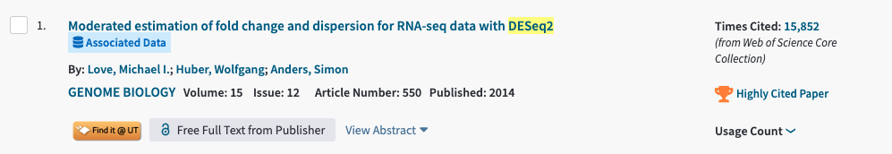
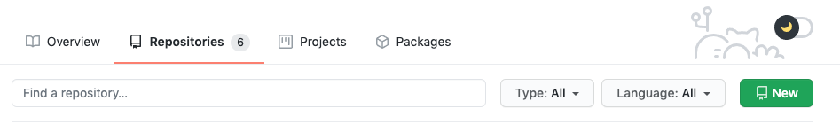
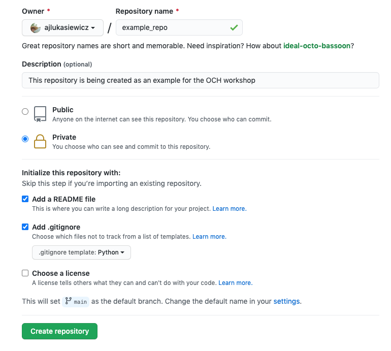
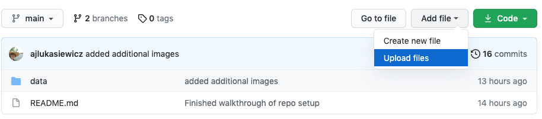
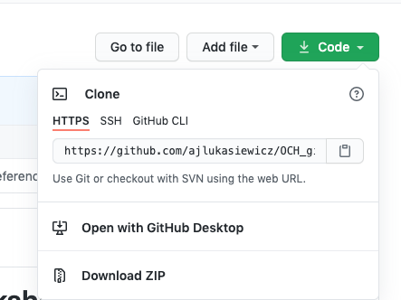

# Open Coding Hour GitHub Workshop

Welcome to the Open Coding Hour GitHub workshop! 
This document is a guide to supplement our hands on workshop during Open Coding Hour on 3/31/2021.

Rachael Cox and Alex Lukasiewicz will walk you through the basics of using GitHub. We will start by covering some common terms used in the git world and then walking through the process of intializing your own repository to begin tracking a solo project.
We will also cover how to work on collaborative projects and demonstrate what happens when things go wrong.

## Why use git? :octocat:

There are tons of reasons why someone would use git, from [hosting a website](https://github.com/wilkelab/wilkelab.github.io) to [publishing a package](https://github.com/rachaelcox/diffprot) to [ensuring reproducibility](https://github.com/marcottelab/CoEVxIMP) of published results  

One of the main advantages to using git while developing your code is for **version control**.

GitHub offers a robust Version Control System (VCS) called git that tracks and maintains a history of changes to files, allowing you to tweak, break, improve, break again, and recover scripts without having to keep track of "myscript_v3.py" one day and "myscript_v4" the next

### More reasons to use git (for bioinformaticians) 
 
  
 *From Perez-Riverol et. al., 2016*
 
On top of maintaining a powerful VCS for your scripts and packages- GitHub plays an important role the scientific community. 
By posting your source code other scientists are able to engage in peer review of your findings, notify you of issues, or use your tool in their work (boosting your impact!) among many other things.

Another major advantage to the GitHub VCS is the ease of which you can collaborate with other programmers. This is facilitated by its forking and branching system (which we will demonstrate later in the workshop) 

*From Jim Vallandingham's "Git Workflow Walkthrough Series"*

### When to use git? 

*From Michael Gray for Sourcecon, 2019*

It can sometimes be a hassle to remember to make commits at key points in your development process, but the best time to start using git is **at the beginning of your project**.
This allows you to take full advantage of the version control system and ensures that anyone who will be collaborating with or using your work will be able to do so reproducibly. 

  - Some issues that may arise by uploding to GitHub at the end of a solo project (right before publication, for example) is leaving out key files or scripts that are required for your processes to run correctly. Of course, you can check this by cloning the repository locally and attempting to run your scripts.

**But what about scripts that cannot be public before a paper is accepted?**

Luckily as students we can all get GitHub Pro for free. This allows you to work in a private repository that you can invite collaborators to, perfect your process, and then make public when your paper is inevitably accepted (because you had amazing version control the whole time). Information on registering for the student licence can be found [here](https://docs.github.com/en/education/explore-the-benefits-of-teaching-and-learning-with-github-education/about-github-education-for-students) 

## Important Vocabulary and Concepts 
Most defitions from [1](https://doi-org.ezproxy.lib.utexas.edu/10.1371/journal.pcbi.1004668)

**Branch**: A copy of the files in your main **repository**. Useful for developing new features while keeping your old code intact. Useful for all the reasons you would want a stable version preserved: fixing bugs, writing new functions, sandboxing, and collaborative changes.

**Clone**: Create a local copy of a repository on your personal computer. Does not maintain a connection to the **repo** you have **cloned** from.

**Commit**: Once changes have been implemented, **commits** are a snapshot of those changes made. Usually associated with some unique message that you can use to track your changes over time.

**Fork**: Copy of another GitHub repository to your own while maintaining a connection to the original repo. Changes made to the main repo can be **pulled** as they are updated. **Forking** allows for collaboration on projects as you can also push changes to be **merged** if allowed by the owner of the repo.

**Merge**: Update files by incorporating changes from your own **branches** or from **forked branches**

**Pull**: To retrieve changes from a remote repository to your local repository 

**Push**: To send changes from your local repository to your remote repository 

**Repository**: Directory containing all of your tracked files with associated version history. Also referred to as a **repo**.

## Dont have GitHub or Git on your device?
If you do not have GitHub, setting up your account and downloading git is easy. For detailed instructions on setup [click here](https://docs.github.com/en/github/getting-started-with-github/set-up-git)
1. Go to [github.com](https://github.com) and set up an account 
2. Download and install git for your OS
3. Open your terminal and configure your local git with your github account info:
  `git config --global user.name "John Doe"`
  `git config --global user.email johndoe@example.com`
  
   *Note: username and password logins are being depreciated by GitHub in August 2021, but logging in with an SSH key is not. [See the GitHub guide to setting up your ssh key](https://docs.github.com/en/github/authenticating-to-github/connecting-to-github-with-ssh)

## Setting up your first GitHub repo on a solo project
This section assumes you already have git installed. 

There are two approaches to initializing a repo on GitHub:
1. From scratch on your GitHub webpage
2. From an already existing local directory 

### Initialize repo from scratch using the GitHub webpage 

1. Navigate to your personal GitHub page and click on the Repositories tab. Then click on the green "new repository" button on the right side of your dashboard.

 
 
2. Name and setup your repository as you would like 

3. Begin adding files via the dropdown menu

### Initialize repo from your local files 

If you have already been working on a project locally, do not fear! You can initialize your a repository in your local directory and start making commits TODAY.

1. Navigate to the directory that you wish to add to a remote github repository 

2. Initialize the git VSC with 

`git init`

3. Then stage all the files you would like to be tracked with `git add [your file]` or to stage all files enter `git add . `

4. Add a commit message with `git commit -m "initial commit" `

5. Then create a new repository from your GitHub profile page as we did above

After this there are two ways to connect to your remote repository:

  **Method 1**

  1. Connect staged local files to online repo. 
  `git remote add origin git@github.com:username/your_repo `

  2. Push files to master branch online
  `git push -u origin master `

  **Method 2**
  
  `git remote add origin https://github.com/username/your_repo`
  
  These commands can be found on your online repo here:
  
  

 

### In class example 1:
Try creating your own repository given either of the methods above. 

This process will require you to have git already installed on your computer and an online github account. 
  
## Forking, Branches, and Merging with Rachael
  
### In class example 2: 

Try forking this repository yourself 
  
## Additional resources to help on your GitHub journey 

**Academic Papers**

* (1) [A Quick Introduction to Version Control with Git and GitHub](https://doi-org.ezproxy.lib.utexas.edu/10.1371/journal.pcbi.1004668)
* (2) [Ten Simple Rules for Taking Advantage of Git and GitHub](https://doi-org.ezproxy.lib.utexas.edu/10.1371/journal.pcbi.1004947)

**Quick Start Guides (good for bookmarking)**

* Quick guide to [getting started with your first repo](https://kbroman.org/github_tutorial/pages/first_time.html)
* For when things go wrong [Oh Shit, Git](https://ohshitgit.com/)
* Markdown guide for :poodle: [git suppored emojis!](https://www.webfx.com/tools/emoji-cheat-sheet/) :poodle:

**For more hands-on practice**

* [GitHub learning labs](https://lab.github.com/)
* Learning more about git branching in a [playable game](https://learngitbranching.js.org/)
* [More resources on branching, pushing, and merging](https://vallandingham.me/git-workflow.html)
* [Writing informative commit messages](https://chris.beams.io/posts/git-commit/)

